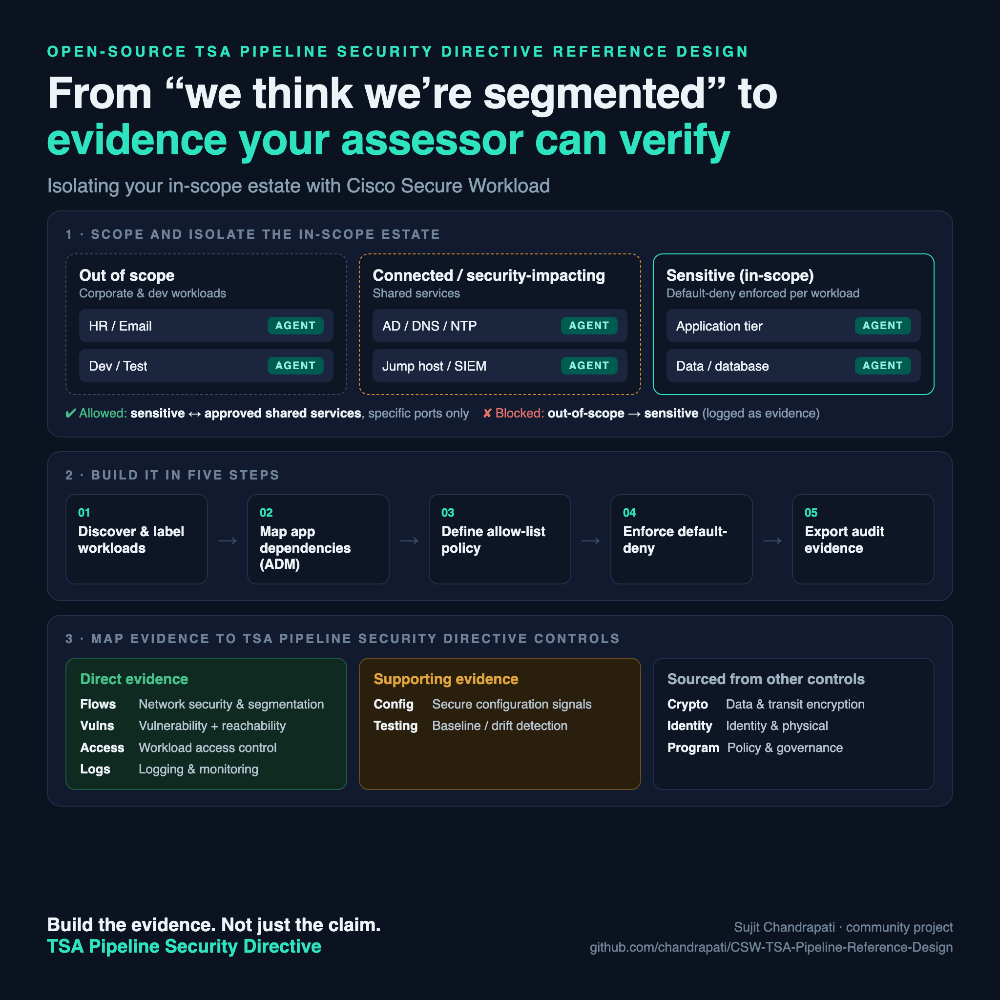
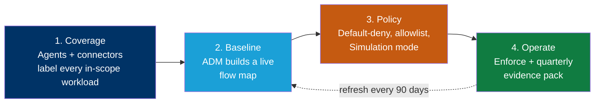
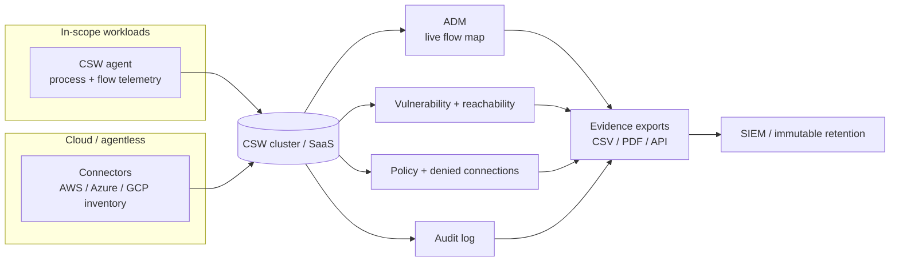
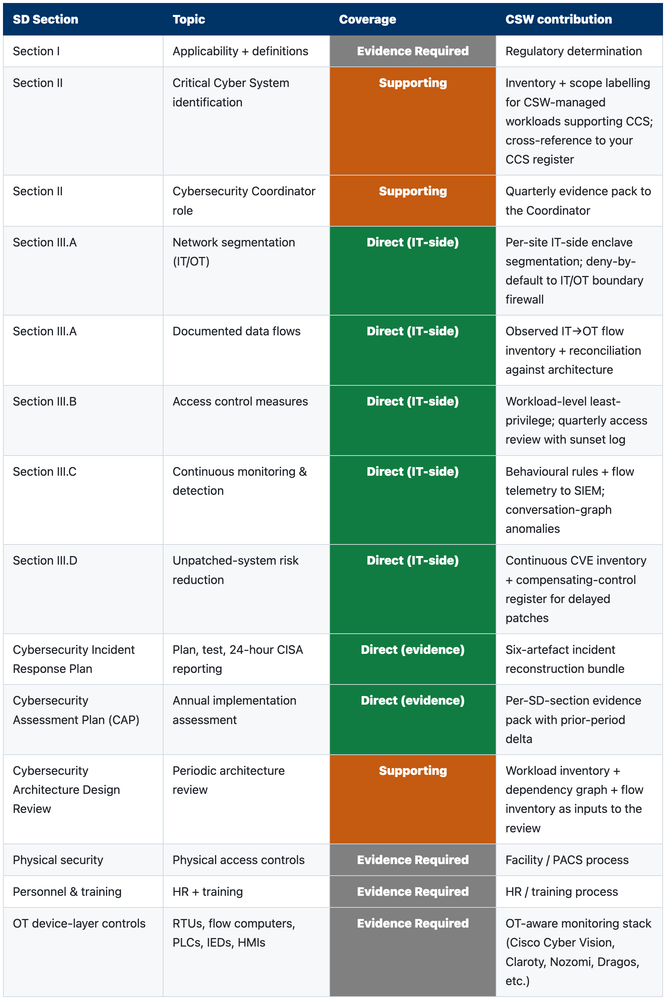

# Cisco Secure Workload — TSA Pipeline Security Directive Reference Design

> A step-by-step blueprint for building **Cisco Secure Workload (CSW)** so an organization can segment its in-scope estate and produce the **machine-generated evidence** an assessor expects under **TSA Pipeline Security Directive** — segmentation, live flow maps, vulnerability reachability, logging, and change-drift detection.

CSW does **not** certify TSA Pipeline Security Directive compliance. It turns workload communication, process activity, and inventory into **evidence** that your team, your compliance function, and your assessor can review. This repo shows how to stand that evidence up and keep it current between assessments.

---

## What's in this repo

| Document | For | Use it to |
|---|---|---|
| **[Reference Design](CSW-TSA-Pipeline-Reference-Design.md)** | SE / platform / security engineering | Build CSW end-to-end: architecture, scopes, labels, ADM, enforcement, per-control evidence |
| **[Compliance Report](#the-compliance-report--what-your-assessor-gets)** ([PDF](CSW-TSA-Pipeline-Compliance-Report.pdf) · [DOCX](CSW-TSA-Pipeline-Compliance-Report.docx)) | Compliance team, assessor, exec | Hand to your assessor: color-coded control-by-control mapping + the exact evidence package |
| **[Evidence Checklist](docs/evidence-checklist.md)** | Evidence owner | A printable "what to export, from where, how often" worklist |
| **[POV / Workshop Plan](docs/pov-plan.md)** | SE + customer | Run a scoped 45-day proof-of-value on one boundary |

---

## How CSW produces evidence — the big picture

Each phase produces a specific, exportable artifact. The **[Reference Design](CSW-TSA-Pipeline-Reference-Design.md)** maps every artifact to a control.

---

## Reference architecture at a glance

---

## Coverage snapshot

CSW provides **🟢 Direct** evidence for **7** mapped control area(s), **🟠 Supporting** input for **3**, and marks **⚪ Evidence Required** *(supplied outside CSW)* for **4**. The full color-coded mapping is in the Compliance Report below.

**Coverage key**

- 🟢 **Direct** — CSW produces the **primary evidence** artifact for the control.
- 🟠 **Supporting** — CSW produces an **input that feeds or complements** another control's evidence.
- ⚪ **Evidence Required** *(supplied outside CSW)* — CSW produces **nothing** here. The control is **in scope for compliance but out of scope for CSW**; the customer supplies the evidence through **another control, tool, or process**. This marks a **boundary, not a gap or a failure.**

> Coverage describes what evidence CSW produces — **not** that a control is passed, and ⚪ never means a control is unsupported.

---

## The Compliance Report — what your assessor gets

The snapshot above is the summary. The **[Compliance Report](CSW-TSA-Pipeline-Compliance-Report.pdf)** is the artifact you actually hand to an assessor — a control-by-control mapping that turns "we use Cisco Secure Workload" into a defensible, color-coded evidence story.

*Every control, the matching CSW implementation, and a color-coded coverage verdict — green (Direct), amber (Supporting), grey (Evidence Required — supplied outside CSW).* **[Open the full report →](CSW-TSA-Pipeline-Compliance-Report.pdf)**

### Why an assessor values it

- **Speaks the assessor's language.** Rows are keyed to the framework's own control IDs, so the assessor can line them up against their work-papers without translation.
- **One-glance coverage verdict.** The color-coded **Coverage** column shows instantly where CSW is the *primary* evidence source vs. a *supporting* input vs. where **other controls must supply the evidence**.
- **Names the exact artifact and where it lives.** The evidence-package table maps each control to a specific CSW export and its collection cadence — so the assessor knows precisely what to request and can reproduce it.
- **Shows control operation as a fact, not a claim.** Isolation is backed by enforced default-deny policy and logged denied connections — evidence that the control *operates*.
- **It's honest — and that builds trust.** The report openly flags what CSW does **not** cover. Assessors trust a vendor mapping far more when it marks its own boundaries.
- **Continuous, not a once-a-year snapshot.** Every row points at a live, re-exportable CSW artifact, so the report regenerates each quarter.

> It is **evidence**, not an attestation. The assessor still determines compliance status — this report just makes their job faster and your position defensible.

---

## Start here

1. Read the **[Reference Design](CSW-TSA-Pipeline-Reference-Design.md)** — architecture + the CSW build steps.
2. Confirm your **in-scope boundary** with your compliance team and assessor.
3. Run the **[POV plan](docs/pov-plan.md)** on one boundary.
4. Track exports with the **[Evidence Checklist](docs/evidence-checklist.md)**.
5. Share the **[Compliance Report](CSW-TSA-Pipeline-Compliance-Report.pdf)** with your assessor.

---

## References & official sources

Authoritative source(s) for **TSA Pipeline Security Directive**. Always validate control references, clause numbers, and versions against the current official text before customer use.

- [TSA — Pipeline Security Directives](https://www.tsa.gov/for-industry/surface-transportation)
- Cisco Secure Workload — [product documentation](https://www.cisco.com/c/en/us/support/security/secure-workload/series.html)

---

## Disclaimer

This repository is for informational and planning purposes. It is **not** legal, regulatory, audit, or certification advice, and it is **not** a TSA Pipeline Security Directive attestation. Validate all control references against the current official TSA Pipeline Security Directive text ([official source](https://www.tsa.gov/for-industry/surface-transportation)), your environment, and your qualified assessor. Replace any bracketed fields before customer delivery.

*Part of the Cisco Secure Workload compliance reference-design series. Umbrella index: [CSW-Compliance-Mapping](https://github.com/chandrapati/CSW-Compliance-Mapping).*
