# TSA Pipeline Security Directive — CSW POV / Workshop Plan

A ~45-day proof-of-value that stands up CSW evidence on **one** compliance boundary. The goal is a repeatable evidence pack and app-owner confidence — not an estate-wide rollout.

> Scope one business service or regulated boundary. Instrumenting the whole estate during a POV is the most common way POVs stall.

```mermaid
gantt
    dateFormat  X
    axisFormat  Day %s
    section Coverage
    Instrument + label           :a1, 0, 10
    section Baseline
    ADM observation (>=2 wks)     :a2, 10, 18
    App-owner signoff             :a3, 24, 4
    section Policy
    Author + Simulation (>=1 wk)  :a4, 29, 10
    section Operate
    Enforce + evidence pack       :a5, 39, 6
```

## Prerequisites

- Defined, documented compliance boundary + current scope document.
- Assessor evidence-request template (or last cycle's findings) to align exports.
- Change-management contact for the enforcement step.

## Day-by-day

### Days 1–10 — Coverage
- Deploy agents to the chosen boundary; add cloud connectors for agentless inventory.
- Apply labels and build the scope sub-tree; record a **cannot-instrument register** (itself evidence).
- **Milestone:** 100% coverage (or justified exceptions) + inventory export.

### Days 11–28 — Baseline
- Run ADM for a full business cycle (≥ 2 weeks; extend across month-end).
- Review discovered clusters with application owners; flag shadow IT, vendor egress, scope creep.
- **Milestone:** app owners sign the cluster-to-application mapping + ADM flow map exported.

### Days 29–45 — Policy → Operate
- Import ADM flows; set **default-deny**; make each allow explicit; log the exception register.
- Run **Simulation ≥ 1 week** — every would-deny becomes a change ticket, not an outage.
- Resolve false positives, **enforce**, and capture a negative test in Denied Connections.
- **Milestone:** enforcement live + first quarterly evidence pack assembled.

## Exit criteria

- [ ] 100% in-scope coverage (or documented exceptions)
- [ ] Signed ADM flow map = the live network-diagram artifact
- [ ] Default-deny policy enforced with a logged denied connection
- [ ] Simulation report + exception register filed
- [ ] A quarterly evidence binder the assessor can consume without a live walkthrough

## Deliverables

- Evidence pack per the [Evidence Checklist](evidence-checklist.md)
- Policy + simulation exports and the exception register
- A short readout mapping each export to the assessor's work-papers

*Tune cadence to the customer's audit cycle and risk appetite. Validate evidence sufficiency with the assessor. CSW evidence is an input to compliance, not an attestation.*
